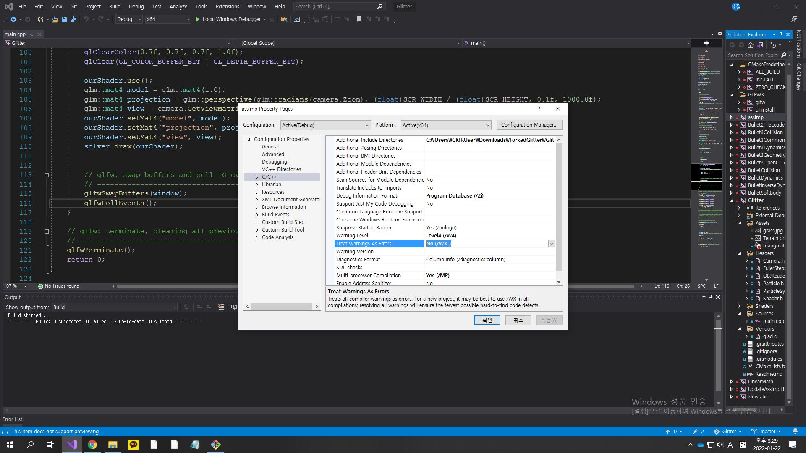

# IK_HumanModel
> October 2019 Jeehon Hyun

This is an IK-solver(using Jacobian matrix and damped-least-squared pseudo-inverse) for the shoulder-to-arm part and the pelvis-to-arm part of the human model.  
The shoulder's position is fixed and it is a ball-and-socket joint. The rest of the joints(elbow, hand) are just revolute joints.

## Demo
https://www.youtube.com/watch?v=n8UnMyvP6Uk&feature=youtu.be

## Key bindings  
R: Reset model back to default  
M: Mouse Mode(Fix the screen and make mouse visible)  
N: Exit Mouse Mode  
1: IK with just the arm  
2: IK with the whole upper part of body  
C: Change hand position and orientation  
Esc: Exit  

For more details regarding Jacobian-based IK solvers, refer to the ```IK Report.pdf``` file.

## How to build and run.
1. Download this repository and go to AnimationFramework/Build directory.
```
git clone --recursive https://github.com/peterhyun/AnimationFramework
cd AnimationFramework
cd Build
```

If you forgot to use the ```--recursive``` flag while cloning this repository, use the following line to update the submodules:  
```git submodule update --init```

2. Make a project/solution file or makefile depending on your platform. I used Microsoft Windows, Visual Studio 2019.
```
# UNIX Makefile
cmake ..

# Mac OSX
cmake -G "Xcode" ..

# Microsoft Windows
cmake -G "Visual Studio 16 2019" ..
...
```
3. Build the project on your platform accordingly.

While building in the Visual Studio 2019 IDE, ```Treat Warning As Errors``` had to be unticked in the project file property settings for building the Assimp library.


4. Run the produced executable file in the command line input.
```./Glitter```

## Directory Structure & Explanation
.  
├── Build  
├── Glitter/  
│   ├── Assets/  
│   │   └── triangulatedTShirt.obj  
│   ├── Headers/  
│   │   ├── Camera.h  
│   │   ├── EulerStepSolver.h  
│   │   ├── OBJReader.h  
│   │   ├── Particle.h  
│   │   ├── ParticleSystem.h  
│   │   └── Shader.h  
│   ├── Shaders/  
│   │   ├── model_loading.fs  
│   │   └── model_loading.vs  
│   ├── Sources/  
│   │   └── main.cpp  
│   └── Vendor/  
├── screenshots/  
├── CMakeLists.txt  
└── Readme.md  

The tree above shows the relevant files/folders of my project. All the code that I wrote is in the ```./Glitter/Headers/```, ```./Glitter/Shaders/```, and ```./Glitter/Sources/``` directory. In this cloth simulation project, I treated the clothing as a system of particles, and each particle contains the following information: position, velocity, and net force which is implemented in ```Particle.h```. The ```OBJReader``` class parses each vertex written in the obj file into a ```Particle```, and the ```ParticleSystem``` class connects adjacent particles as if a damped mass spring is connected between them. The ```EulerStepSolver``` class applies forces in the ```ParticleSystem``` and calculates the newly updated particle position per time step. The new particle position is rendered on screen via the render loop implemented in ```main.cpp```.

The shaders I utilized are the vertex shader and fragment shader. You can find the relevant glsl code in ```model_loading.vs``` and ```model_loading.fs``` respectively. It's just basic glsl in this case, so I won't go through it deeply.

## Acknowledgement
The basic OpenGL Setup boilerplate of this code is from Kevin Fung's Glitter repository: https://github.com/Polytonic/Glitter
With this boilerplate, you can test this code in Windows, Linux, or Mac environment. The only dependency it requires is CMake.

-------------------------------------------------------------------------------------------------------------------
## MIT License of the Glitter Boilerplate
>The MIT License (MIT)

>Copyright (c) 2015 Kevin Fung

>Permission is hereby granted, free of charge, to any person obtaining a copy of this software and associated documentation files (the "Software"), to deal in the Software without restriction, including without limitation the rights to use, copy, modify, merge, publish, distribute, sublicense, and/or sell copies of the Software, and to permit persons to whom the Software is furnished to do so, subject to the following conditions:

>The above copyright notice and this permission notice shall be included in all copies or substantial portions of the Software.

>THE SOFTWARE IS PROVIDED "AS IS", WITHOUT WARRANTY OF ANY KIND, EXPRESS OR IMPLIED, INCLUDING BUT NOT LIMITED TO THE WARRANTIES OF MERCHANTABILITY, FITNESS FOR A PARTICULAR PURPOSE AND NONINFRINGEMENT. IN NO EVENT SHALL THE AUTHORS OR COPYRIGHT HOLDERS BE LIABLE FOR ANY CLAIM, DAMAGES OR OTHER LIABILITY, WHETHER IN AN ACTION OF CONTRACT, TORT OR OTHERWISE, ARISING FROM, OUT OF OR IN CONNECTION WITH THE SOFTWARE OR THE USE OR OTHER DEALINGS IN THE SOFTWARE.
